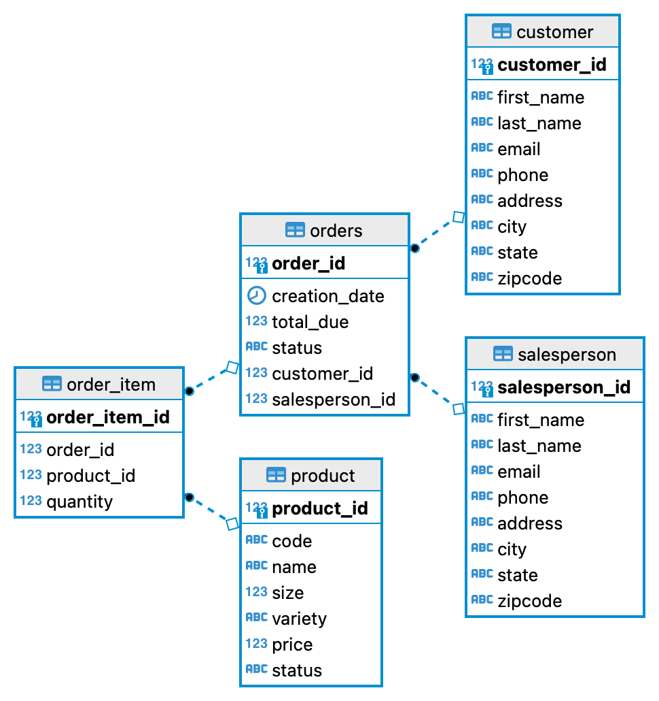

# Introduction

The purpose of this application is to demonstrate how to perform the typical database CRUD (Create,
Read, Update, Delete) functions using JDBC (Java Database Connectivity) API. The sample program was
run using a Postgres database running in a Docker container using the Postgres JDBC driver.

# Implementation

## ER Diagram

## Design Patterns

The Data Access Object (DAO) design pattern is a structural pattern that isolates the
application/business layer from the persistence layer. The API hides from the application all the
complexity of performing CRUD operations in the underlying storage mechanism.

The Repository design pattern acts as a middle layer between the rest of the application and the
data access logic. The pattern isolates all the data access code from the rest of the application.
It is an abstraction of a collection of objects. It is used more when SQL JOINS are not required.

# Test

Testing of the application was done by creating a Docker container running the Postgres database.
The SQL scripts (located in the sql directory) created the database and loaded the test data. This
data was then used to test the application against and to compare the results.
