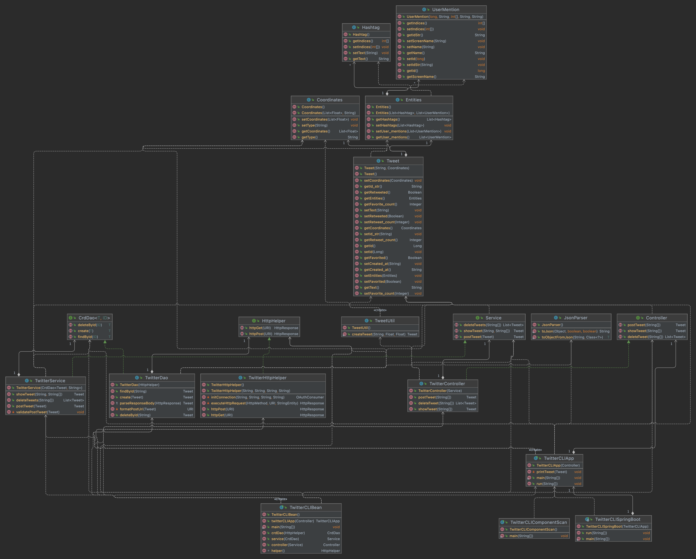

# Introduction
The Twitter application allows via a Command Line Interface (CLI) a user to create
a Tweet, delete a tweet, and to query a Tweet. (This is similar to create, read,
update, and delete operations typically done against a database.)
The application is written in Java and uses the Twitter V1.1 API via REST
(Representational state transfer) HTTP calls to perform these functions.
The application runs in a Docker container and can be invoked via the command
line. It was built using Maven and external Java libraries.

# Quick Start
- Packaging app using Maven:  
  `mvn clean package -Dmaven.test.skip=true`

- Running app using Docker:
    - Pull docker image from DockerHub:  
      `docker pull rpolisuk/twitter`
    - Run container :
      ```
      docker run --rm \
      -e consumerKey=CONSUMER_KEY \
      -e consumerSecret=CONSUMER_SECRET \
      -e accessToken=ACCESS_TOKEN \
      -e tokenSecret=ACCESS_TOKEN_SECRET \
      rpolisuk/twitter post|show|delete [options]
      ```
  Options:
    - post: tweet_text latitude:longitude
    - show: tweet_id [field1,field2 ...]
    - delete: [id1, id2, ...]

# Design
## UML diagram


## App
The entry point for the application is the ```TwitterCLISpringBoot``` class.
This class creates a ```TwitterCLIApp``` object which is then executes the run
method in it after verifying the correct option was used passing the arguments to it. 

## Controller
The ```TwitterController``` object verifies that the correct number
of arguments have been passed to the program and then calls the service layer.

## Service
The ```TwitterService``` object implements the business logic for the application.
This means checking the length of the tweets are correct and that the longitude
and latitude are correct. It then calls the DAO layer.

## Data Access Object (DAO)
The ```TwitterDao``` object formats the API calls per the correct
format required by the Twitter API. It then calls the HTTP method using
the ```TwitterHelper``` object.

## Models
The tweet data model is based on Twitter's Data Dictionary v1.1
(https://developer.twitter.com/en/docs/twitter-api/v1/data-dictionary/object-model/tweet).
It contains:
* Tweet object - tweets are the basic atomic building block of all things Twitter. Tweets are also known as "status updates". 
* User object - this is a child object of Tweet. It contains Twitter User account metadata that describes the Twitter User referenced.
* Entities object - this is a child object of Tweet. It is made up of arrays of entity objects.
* Hashtag object - this is a child object of Entities. It contains an array containing an object for every hashtag included in the Tweet body, and include an empty array if no hashtags are present.

## Spring
The Spring Framework was used to help solve the dependency management
problem. It replaces the ```TwitterCLIApp``` with a Spring framework using
the Inversion of Control or dependency injection principle.
Using `@Component`, `@Controller`, `@Service` and `@Repository` in the layers, 
they are marked as Beans in the `TwitterCLISpringBoot` to replace 
the traditional `main` approach.

# Test
The application was developed on a MacBook Pro using the IntelliJ IDE. JUnit
version 4 was used for Integration testing of the different application
layers. Where the Mockito Framework was used to test for the unit testing
using mock objects to avoid making actual Twitter API calls requiring
valid Twitter keys.

## Deployment
The application was dockerized by creating a Dockerfile running OpenJDK 
using Alpine. Maven was used to package the Java code which was then written
into the docker image. A docker CLI command was then used to execute the
program.

# Improvements
- Use the Twitter4J (https://twitter4j.org/en/index.html) Java library instead. This will simplify the program.
- Use the Twitter V2 API instead which is the latest.
- Allow direct messages to Twitter users.