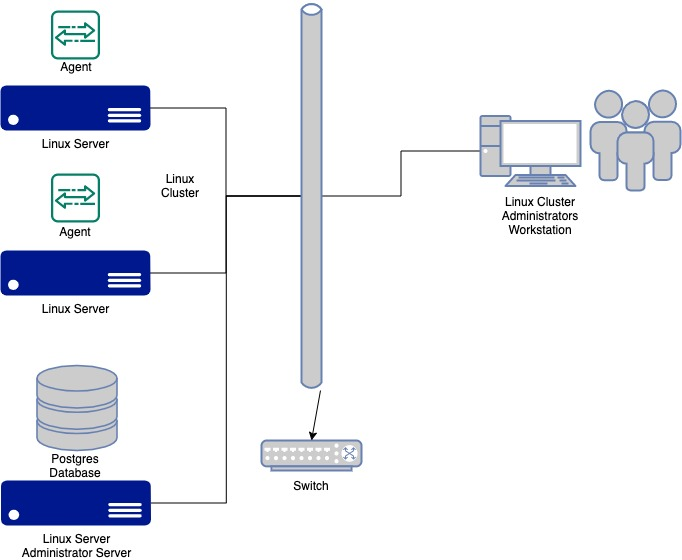

# Linux Cluster Monitoring Agent

This project is under development. Since this project follows the GitFlow, the final work will be merged to the master
branch after Team Code Team.

# Introduction

The Jarvis Linux Cluster Administration (LCA) runs a Linux cluster of Linux servers which are used by Jarvis
consultants. This project provides a monitoring solution for the LCA team to be able to monitor and properly administer
these servers. Custom Linux agents run on each node of the Linux cluster running CentOS 7 and will record hardware
specifications of the servers and will collect CPU/memory resource usage every minute. This information will be added
and stored in a central Postgres database running on a dedicated server. The LCA team will generate reports using this
data by the LCA team to help monitor and support the cluster.

The technologies used in this project are:

- bash scripts (used to gather the hardware specifications, resource usage, and manage docker)
- Postgres v9.6 database (stores the collected data)
- psql v9.2 (used to administer the Postgres database)
- git v2.30.1 (version control software)
- Docker v20.10.11 (container running the PostGre database)
- IntelliJ IDEA v2021.2.3 (used as the IDE to edit files)
- Jarvis Remote Desktop (JRD) (development and testing environment running CentOS 7)
- Google Cloud Platform (GCP) provided the instance to run the JRD

# Quick Start

The following are the quick start commands/files needed to manage ths system.

## psql_docker.sh

The following command will create the Postgres container.

```
psql_docker.sh create [db_username] [db_password]
```

where db_username is the Postgres username and db_password is the Postgres password.

The following command will start the Postgres container.

```
psql_docker.sh start
```

The following command will stop the Postgres container.

```
psql_docker.sh stop
```

## ddl.sql

This file contains the Postgres schema required to create the two tables to store the hardware and CPU/memory
information. It should be called using the psql command.

````
    psql -h localhost -U postgres -d host_agent -f sql/ddl.sql    
````

## host_info.sh

```
    ./scripts/host_info.sh psql_host psql_port db_name psql_user psql_password
```

## host_usage.sh

```
    ./scripts/host_info.sh psql_host psql_port db_name psql_user psql_password
```

## Crontab setup

```
    # edit crontab file
    crontab -e

    # add following line to the file
    * * * * * bash <your path>/host_usage.sh psql_host psql_port db_name psql_user psql_password > /tmp/host_usage.log
```

# Implementation

## Architecture



## Scripts

## Database Modeling

# Test

# Deployment

# Improvements
